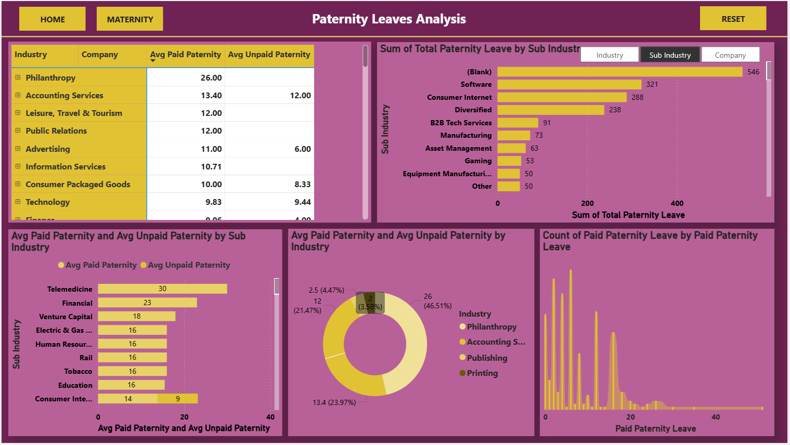
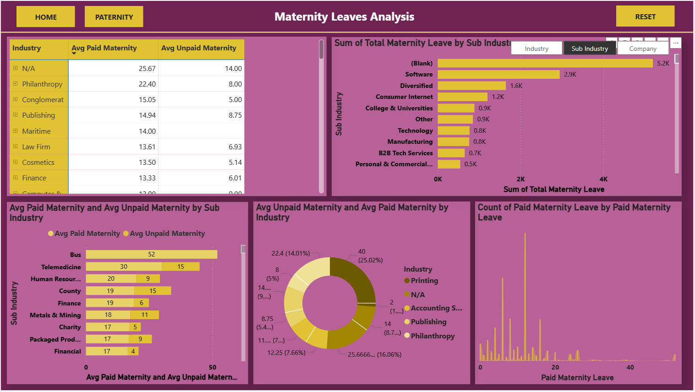

#  Power BI Parental Leave Analysis

An interactive Power BI dashboard uncovering insights on **parental leave trends, utilization rates, and workforce participation** across different demographics and industries.  
It explores **maternity** and **paternity** leave trends, comparing **average paid vs. unpaid durations**, **industry-level variations**, and **overall workforce patterns**.

The goal of this project is to demonstrate data visualization, dashboard design, and storytelling using realistic HR and policy data.  

> ⚠️ *Note: This project is created for **portfolio and demonstration purposes only**.  
> The underlying dataset was obtained from a public analytics challenge and is used solely to showcase analytical and visualization skills.*

🔗 **Live Dashboard:** [View Power BI Report](https://app.powerbi.com/view?r=eyJrIjoiYTYzM2U4NWItNzkwOC00OTdhLTg0NDMtZjQ3ZTJmNGU3MWQyIiwidCI6IjVmZjFhNjdjLTEwZmItNDMzNy04ZTEzLWI2NTI0M2IxMTA1NiJ9)  

---
## 📊 Key Insights

- 🧭 Interactive visuals exploring **leave utilization** by gender, region, and organization type  
- 📅 **Trend analysis** on leave duration and return-to-work timelines  
- ⚖️ Correlation between **policy benefits** and **employee retention rates**  
- 👨‍👩‍👧‍👦 Data storytelling through clear visual design and KPI summaries  

---
## 📊 Key Insights & Visuals

### 👩‍🍼 Maternity Leave Dashboard
- Central navigation with interactive buttons linking to:
  - 🔗 **Home Dashboard**
  - 🔗 **Paternity Leave Dashboard**
  - 🔗 **Reset** - This button resets all the selection back to normal.
- Enables users to switch easily between gender-based insights 

Following Charts have been used for visualization:
- 🧮 **Matrix Chart:** Average paid vs. unpaid maternity leave across industries  
- 📊 **Clustered Bar Chart:** Total maternity leave days by sub-industry  
- 🧱 **Stacked Bar Chart:** Ratio of paid to unpaid maternity leave by sub-industry  
- 🍩 **Donut Chart:** Average paid vs. unpaid maternity leave by industry  
- 🎀 **Ribbon Chart:** Distribution of paid maternity leave durations across industries  

### 👨‍🍼 Paternity Leave Dashboard
- Central navigation with interactive buttons linking to:
  - 🔗 **Home Dashboard**
  - 🔗 **Maternity Leave Dashboard**
  - 🔗 **Reset** - This button resets all the selection back to normal.
- Enables users to switch easily between gender-based insights 
- Mirrored visuals offering side-by-side comparison of **average paid vs. unpaid paternity leave**, **total leave days**, and **industry-level differences**  

### 🏠 Main Dashboard Overview
- Central navigation with interactive buttons linking to:
  - 🔗 **Maternity Leave Dashboard**
  - 🔗 **Paternity Leave Dashboard**
- Enables users to switch easily between gender-based insights  

## 🖼️ Dashboard Preview
### Overview

### Paternity page

### Maternity page

### Summary page

---

## 💡 Highlights

- Built with **Microsoft Power BI Desktop & Service**  
- Focused on **insight communication** and **visual storytelling**  
- No proprietary or confidential data used
- Created for **demonstration purposes** only — not intended for reuse or redistribution

---

## ⚠️ License

This repository is licensed under the **Creative Commons Attribution–NonCommercial–NoDerivatives 4.0 International (CC BY-NC-ND 4.0)** license.

That means:
- ✅ You can **view and share** this project **with attribution**  
- 🚫 You **cannot modify, reuse, or distribute** it for commercial or derivative purposes  

📄 **[Read the full license here](https://creativecommons.org/licenses/by-nc-nd/4.0/)**

---

## 📬 Contact

👩‍💻 **Author:** Shivani Parekh  
🌐 **Portfolio:** [shivaniparekh.github.io/shivani-portfolio/](https://shivaniparekh.github.io/shivani-portfolio/)  
🔗 **LinkedIn:** [linkedin.com/in/shivani-parekh-/](https://linkedin.com/in/shivani-parekh-/)  
📧 **Email:** [parekh.shivani21@gmail.com](mailto:parekh.shivani21@gmail.com)

⭐ *If you found this dashboard inspiring, consider starring this repo!*
